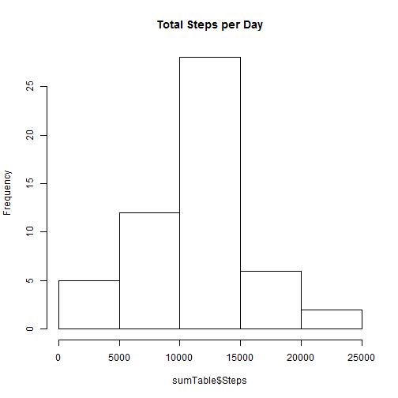
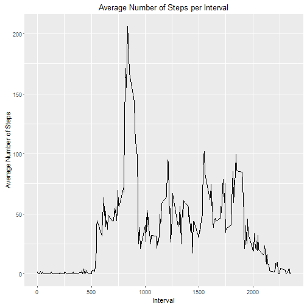
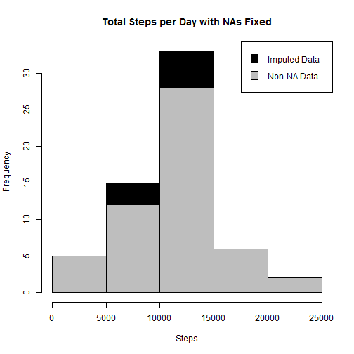
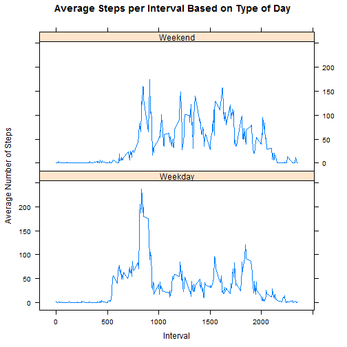

Reproducible Research: Peer Assessment 
======================================


```r
##transfrom the .Rmd to a markdown (.md) file

knit ('PA1_template.Rmd')
```

```
## 
## 
## processing file: PA1_template.Rmd
```

```
## 
  |                                                                       
  |                                                                 |   0%
  |                                                                       
  |................................                                 |  50%
##   ordinary text without R code
## 
## 
  |                                                                       
  |.................................................................| 100%
## label: unnamed-chunk-3
```

```
## Warning in replayPlot(x): "xlabs" is not a graphical parameter

## Warning in replayPlot(x): "xlabs" is not a graphical parameter

## Warning in replayPlot(x): "xlabs" is not a graphical parameter

## Warning in replayPlot(x): "xlabs" is not a graphical parameter
```

```
## output file: PA1_template.md
```

```
## [1] "PA1_template.md"
```

```r
## Loading the data


activity <- read.csv ("C:/Apps/python/R/repdata-data-activity/activity.csv")
```


```r
activity$day <- weekdays(as.Date(activity$date))

activity$DateTime <- as.POSIXct(activity$date, format = "%Y -%m - %d")

## pulling data without NA values 


clean <- activity[!is.na(activity$steps),]


## Total steps by day

sumTable <- aggregate (activity$steps ~ activity$date, FUN= sum, )
colnames (sumTable) <- c ("Date", "Steps")

library (ggplot2)
library (plyr)

## Creating histogram of total steps per day as shown below

hist (sumTable$Steps, breaks = 5, xlabs ="steps", main = "Total Steps per Day")
```

```
## Warning in plot.window(xlim, ylim, "", ...): "xlabs" is not a graphical
## parameter
```

```
## Warning in title(main = main, sub = sub, xlab = xlab, ylab = ylab, ...):
## "xlabs" is not a graphical parameter
```

```
## Warning in axis(1, ...): "xlabs" is not a graphical parameter
```

```
## Warning in axis(2, ...): "xlabs" is not a graphical parameter
```



```r
## Mean of the total steps

as.integer(mean(sumTable$Steps))
```

```
## [1] 10766
```

```r
## The Median is also shown below

as.integer(median(sumTable$Steps))
```

```
## [1] 10765
```

```r
## What is the average daily activity pattern?


clean <- activity[!is.na(activity$steps),]

##create average number of steps per interval

intervalTable <- ddply(clean, .(interval), summarize, Avg = mean(steps))


##Create line plot of average number of steps per interval
p <- ggplot(intervalTable, aes(x=interval, y=Avg), xlab = "Interval", ylab="Average Number of Steps")
p + geom_line()+xlab("Interval")+ylab("Average Number of Steps")+ggtitle("Average Number of Steps per Interval")
```



```r
##Maximum steps by interval
maxSteps <- max(intervalTable$Avg)

##Which interval contains the maximum average number of steps

intervalTable[intervalTable$Avg==maxSteps,1]
```

```
## [1] 835
```

```r
##Number of NAs in original data set
nrow(activity[is.na(activity$steps),])
```

```
## [1] 2304
```

```r
## Create the average number of steps per weekday and interval

avgTable <- ddply(clean, .(interval, day), summarize, Avg = mean(steps))


## Create dataset with all NAs for substitution

nadata<- activity[is.na(activity$steps),]

## Merge NA data with average weekday interval for substitution

newdata<-merge(nadata, avgTable, by=c("interval", "day"))

## Reorder the new substituded data in the same format as clean data set
newdata2<- newdata[,c(6,4,1,2,5)]

colnames(newdata2)<- c("steps", "date", "interval", "day", "DateTime")

##Merge the NA averages and non NA data together
mergeData <- rbind(clean, newdata2)


##Create sum of steps per date to compare with step 1
sumTable2 <- aggregate(mergeData$steps ~ mergeData$date, FUN=sum, )
colnames(sumTable2)<- c("Date", "Steps")

## Mean of Steps with NA data taken care of
as.integer(mean(sumTable2$Steps))
```

```
## [1] 10821
```

```r
## Median of Steps with NA data taken care of

as.integer(median(sumTable2$Steps))
```

```
## [1] 11015
```

```r
## Creating the histogram of total steps per day, categorized by data set to show impact

hist(sumTable2$Steps, breaks=5, xlab="Steps", main = "Total Steps per Day with NAs Fixed", col="Black")

hist(sumTable$Steps, breaks=5, xlab="Steps", main = "Total Steps per Day with NAs Fixed", col="Grey", add=T)

legend("topright", c("Imputed Data", "Non-NA Data"), fill=c("black", "grey") )
```



```r
##Are there differences in activity patterns between weekdays and weekends?


## Create new category based on the days of the week

mergeData$DayCategory <- ifelse(mergeData$day %in% c("Saturday", "Sunday"), "Weekend", "Weekday")

library(lattice) 


## Summarize data by interval and type of day

intervalTable2 <- ddply(mergeData, .(interval, DayCategory), summarize, Avg = mean(steps))

##Plot data in a panel plot

xyplot(Avg~interval|DayCategory, data=intervalTable2, type="l",  layout = c(1,2),
       main="Average Steps per Interval Based on Type of Day", 
       ylab="Average Number of Steps", xlab="Interval")
```


